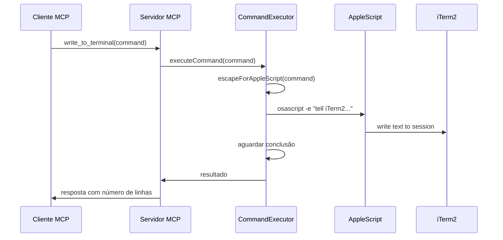
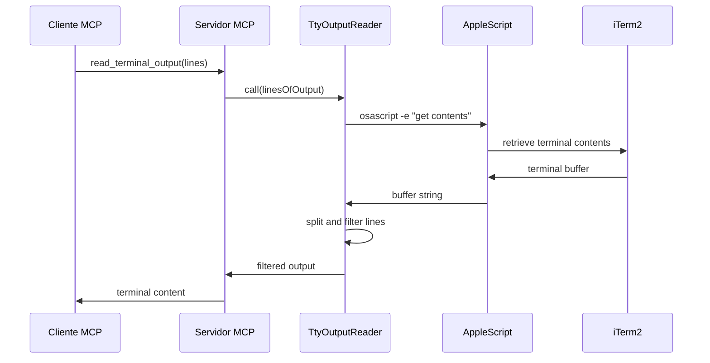

# Análise da Arquitetura - iTerm MCP TypeScript

## Visão Geral da Arquitetura

O projeto iTerm MCP em TypeScript implementa um servidor Model Context Protocol que permite interação com o terminal iTerm2 através de AppleScript. A arquitetura é modular e bem estruturada.

## Componentes Principais

### 1. Servidor Principal (`index.ts`)
- **Função**: Ponto de entrada do servidor MCP
- **Responsabilidades**:
  - Configuração do servidor MCP
  - Registro das ferramentas disponíveis
  - Roteamento de requisições JSON-RPC
  - Gerenciamento do transporte stdio

### 2. Ferramentas/Tools Implementadas

#### 2.1 `write_to_terminal`
- **Descrição**: Escreve texto/comandos no terminal ativo do iTerm
- **Parâmetros**: `command` (string)
- **Funcionalidade**: Envia comandos para execução no terminal

#### 2.2 `read_terminal_output`
- **Descrição**: Lê a saída do terminal iTerm ativo
- **Parâmetros**: `linesOfOutput` (integer)
- **Funcionalidade**: Captura as últimas N linhas do buffer do terminal

#### 2.3 `send_control_character`
- **Descrição**: Envia caracteres de controle para o terminal
- **Parâmetros**: `letter` (string)
- **Funcionalidade**: Envia sequências como Ctrl+C, Ctrl+Z, etc.

### 3. Módulos Core

#### 3.1 CommandExecutor.ts
- **Responsabilidades**:
  - Execução de comandos via AppleScript
  - Tratamento de comandos multilinhas
  - Escape de strings para AppleScript
  - Monitoramento de execução de comandos
  - Detecção de término de execução

**Funcionalidades Chave**:
- Escape seguro de strings para AppleScript
- Tratamento especial para texto multilinha
- Aguardar conclusão de comando
- Verificação de estado de processamento

#### 3.2 TtyOutputReader.ts
- **Responsabilidades**:
  - Leitura do buffer completo do terminal
  - Extração de número específico de linhas
  - Interface com AppleScript para captura de conteúdo

**Funcionalidades Chave**:
- Captura completa do buffer via AppleScript
- Filtragem por número de linhas
- Parsing do conteúdo do terminal

#### 3.3 SendControlCharacter.ts
- **Responsabilidades**:
  - Envio de caracteres de controle ASCII
  - Mapeamento de letras para códigos de controle
  - Tratamento de casos especiais (Escape, telnet escape)

**Funcionalidades Chave**:
- Conversão letra -> código ASCII de controle
- Suporte a caracteres especiais
- Validação de entrada

#### 3.4 ProcessTracker.ts
- **Responsabilidades**:
  - Monitoramento de processos ativos no TTY
  - Cálculo de métricas de recursos (CPU, memória)
  - Detecção de ambiente de execução
  - Construção de cadeia de processos

**Funcionalidades Chave**:
- Detecção de processo em primeiro plano
- Cálculo de score de interesse do processo
- Métricas de recursos agregadas
- Detecção de REPLs e ambientes especiais

## Fluxo de Dados

### Escrita no Terminal


### Leitura do Terminal


## Dependências Chave

### Dependências de Produção
- `@modelcontextprotocol/sdk`: Framework MCP
- Node.js built-ins: `child_process`, `fs`, `util`

### Dependências de Sistema
- **AppleScript**: Interface principal com iTerm2
- **osascript**: Executável para scripts AppleScript
- **iTerm2**: Terminal alvo da integração
- **macOS**: Sistema operacional requerido

## Características Técnicas

### Pontos Fortes
1. **Modularidade**: Separação clara de responsabilidades
2. **Robustez**: Tratamento de erro e casos extremos
3. **Flexibilidade**: Suporte a comandos simples e complexos
4. **Monitoramento**: Rastreamento detalhado de processos

### Pontos de Atenção
1. **Dependência AppleScript**: Limitado ao macOS
2. **Acoplamento iTerm2**: Específico para este terminal
3. **Complexidade de Escape**: Strings multilinhas requerem cuidado especial
4. **Timing**: Dependente de polling para detectar conclusão

## Estrutura de Arquivos
```
typescript/iterm-mcp/
├── src/
│   ├── index.ts              # Servidor principal
│   ├── CommandExecutor.ts    # Execução de comandos
│   ├── TtyOutputReader.ts    # Leitura de saída
│   ├── SendControlCharacter.ts # Caracteres de controle
│   └── ProcessTracker.ts     # Rastreamento de processos
├── package.json              # Dependências e scripts
├── tsconfig.json            # Configuração TypeScript
└── test/                    # Testes unitários
```

Esta arquitetura serve como base sólida para a reimplementação em Rust, mantendo a mesma funcionalidade e melhorando a performance e confiabilidade.
